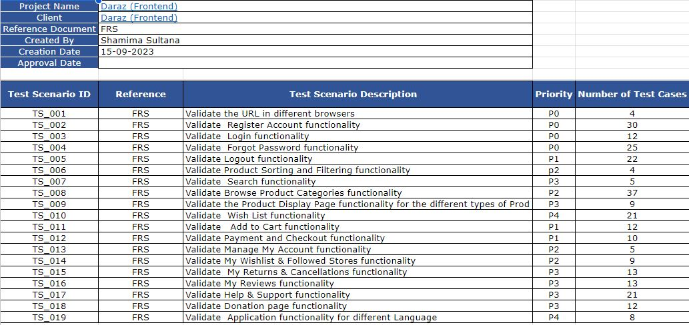
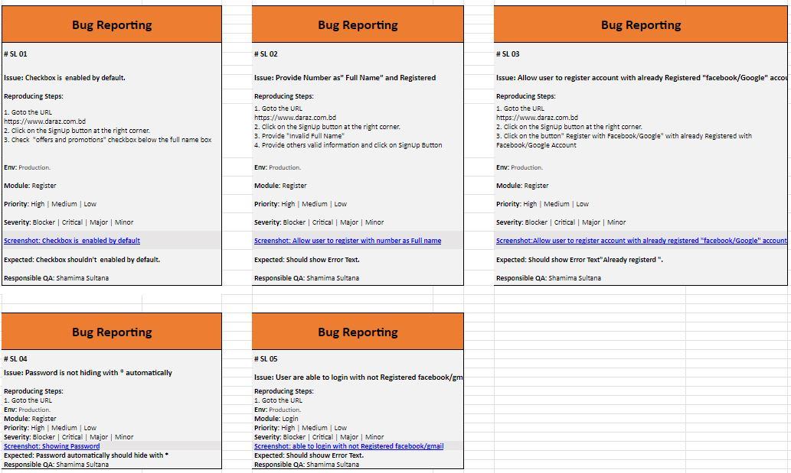

# Manual Testing Project: Daraz Frontend

This repository is dedicated to the manual testing of the Daraz Frontend application. In this README, you will find essential information and guidelines for conducting manual testing, documenting test cases, and reporting bugs. The project also includes test plans, mind maps, test scenarios, test cases, reports, bug reports, test metrics, and recommendations to ensure a structured testing process.

## Table of Contents

1. [Test Plan](#test-plan)
2. [Mind Map](#mind-map)
3. [Test Scenarios](#test-scenarios)
4. [Test Cases](#test-cases)
5. [Report](#report)
6. [Bug Report](#bug-report)
7. [Test Metrics](#test-metrics)
8. [Recommendations](#recommendations)

## Test Plan

The test plan outlines the overall testing strategy for the Daraz front-end application. It includes information about the scope of testing, testing objectives, test environments, and schedules.


## Mind Map

The mind map visually represents the testing scope, objectives, and focus areas. It serves as a high-level guide for testers to understand the testing landscape. You can view the mind map in the Daraz Mindmap.png file.


## Test Scenarios

The test scenarios provide a list of high-level scenarios to be tested, helping testers understand what to focus on during testing. These scenarios are listed in the Test scenario.xlsx file.



## Test Cases

Detailed test cases are documented to ensure systematic testing of the application. Test cases cover various functionalities, features, and edge cases. You can find these test cases in the Test Cases execution result.xlsx file.


## Report

The test report summarizes the testing activities, including the number of test cases executed, passed, and failed. It offers an overview of the overall test results. The test report can be found in the Full Report Daraz.xlsx file.


## Bug Report

If any issues or defects are identified during testing, they should be reported using the bug report template provided in the Bug Report.xlsx file. Ensure that bug reports are detailed and provide steps to reproduce the issues.



## Test Metrics

To gauge the testing progress and quality, various test metrics are calculated and presented in the Test Metrics.xlsx file. These metrics include pass/fail percentages, defect density, and more.


## Recommendations

The recommendations section offers insights and suggestions for improving the quality of the Daraz Frontend application.


## Downloading the Repository

**Download the Repository**:
   - Create a folder on your local machine where you want to store this repository.
   - Open your terminal or command prompt.
   - Use the following command to clone the repository to your chosen folder:

     ```bash
     git clone https://github.com/ShamimaSultanaMiley/Manual-Testing-Daraz-Frontend-.git
     ```


